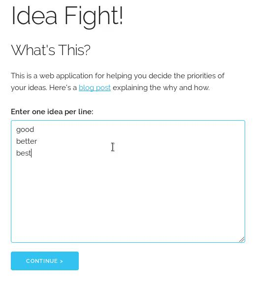
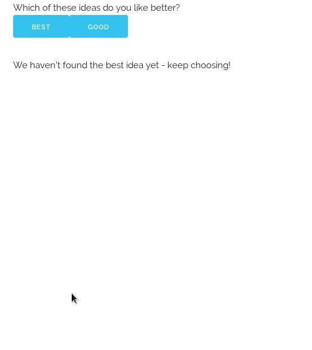
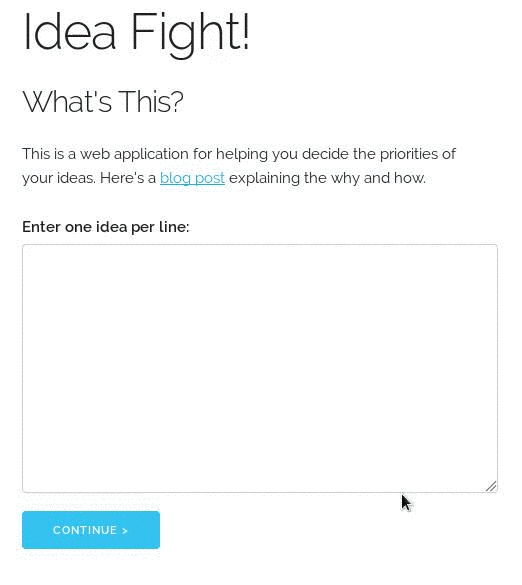

# Idea Fight

## What Is This?

Idea Fight is a web application for helping you prioritize a list of ideas.
For details on why I wrote this on how it works, check out this
[blog post](http://hoelz.ro/blog/idea-fight).

## Installation

Idea Fight is a client-side-only web application, so you don't need to install
anything if you don't want to!  There's a version that you can use at
http://idea-fight.hoelz.ro.

If you want to install your own version in order to make changes, you'll need
to install the [Elm compiler](http://elm-lang.org) version 0.17.1 (the most
current as of this writing).  After you have Elm installed, you can build
the JavaScript file using `elm-make`:

    elm-make --output js/idea-fight.js Main.elm

Copy the `js/`, `css/`, and `index.html` files to wherever you want to host your
version, or simply open `index.html` in your browser.

# How to Use It

To use Idea Fight, just enter a list of ideas into the provided text box, one per line:

Once you're done, hit the "Continue" button, and you'll be presented with two
ideas among the ideas you entered in:

Click the idea you prefer between the choices.  As Idea Fight determines which
ideas are the best, it will present them to you; keep making selections until
you have as many good ideas as you want!

